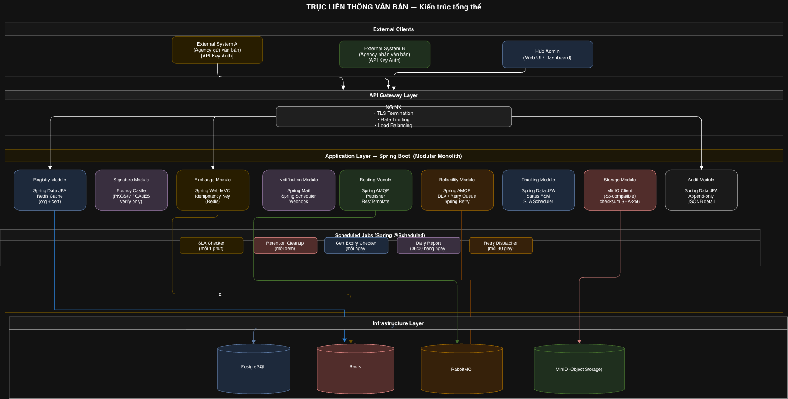
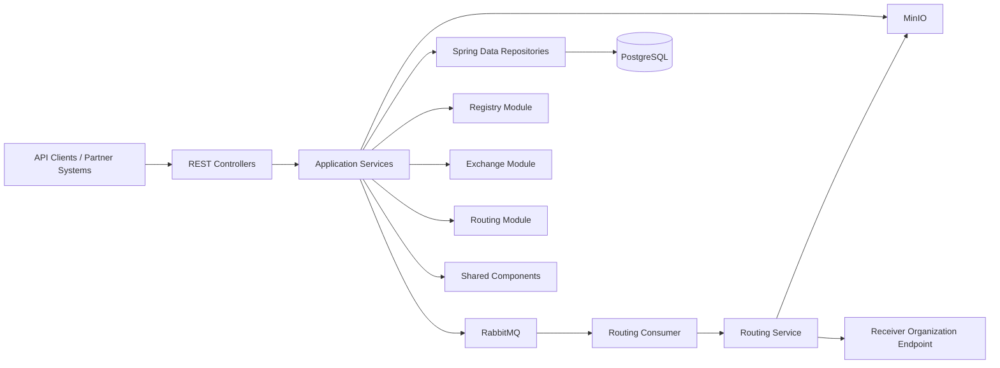
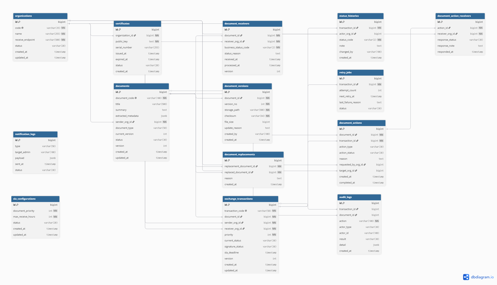
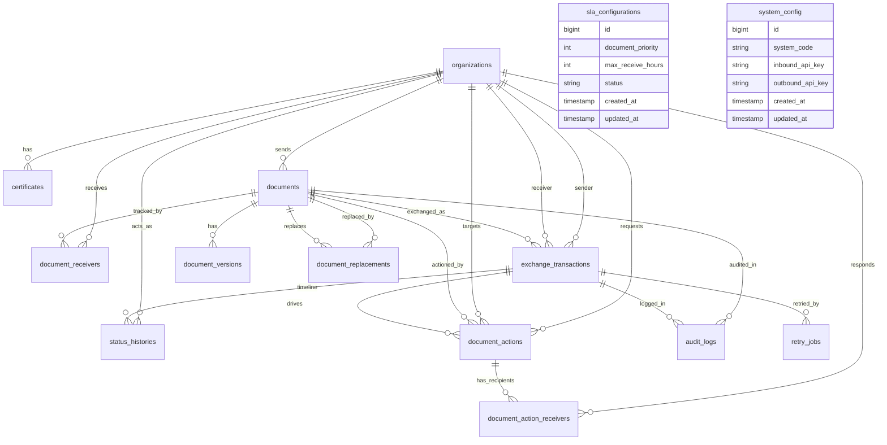

# TrucVanban

TrucVanban is a Spring Boot-based document exchange platform for inter-agency document circulation. It manages organization registration, certificates, SLA configurations, document intake, routing, acknowledgment, status tracking, and file storage.

## Documentation Sources

This README was prepared from the project codebase and the supporting business documents in `business/`, including:

- `business/TÀI LIỆU ĐẶC TẢ API.docx`
- `business/Tài liệu Đặc tả Use Case.docx`
- `business/Architecture_Overview.drawio.png`
- `business/coreflow.drawio.png`
- `business/ERD.png`

## Business Domain

The system acts as a central broker for exchanging official documents between registered organizations.

### Core capabilities

- Register and manage organizations participating in the platform
- Store and rotate organization certificates
- Configure SLA rules by document priority
- Accept incoming exchange requests with file upload
- Persist document metadata and version history
- Route documents to receiver organizations through RabbitMQ
- Forward document payloads to partner endpoints with an outbound API key
- Record acknowledgment statuses from receivers
- Track transaction timelines and business statuses

### Main business flow

1. A sender organization submits a document exchange request.
2. The system validates the sender and receiver organizations.
3. The document metadata is stored in the database.
4. The uploaded file is stored in MinIO as a document version.
5. A transaction is created for each receiver.
6. A routing message is published to RabbitMQ after the database transaction commits.
7. The routing consumer retrieves the message and dispatches the file to the receiver endpoint.
8. The receiver returns acknowledgement data, which is stored as receiver status and status history.
9. Clients can query sent and received transaction status.

## System Architecture

The application follows a layered Spring Boot architecture.

### Architecture layers

- `controller`: Exposes REST endpoints and returns the standard response wrapper.
- `service`: Holds business logic for registry, exchange, routing, and storage operations.
- `repository`: Provides data access to PostgreSQL via Spring Data JPA.
- `entity`: Represents the persistence model.
- `mapper`: Converts between entities and DTOs.
- `consumer`: Handles asynchronous routing messages from RabbitMQ.
- `shared`: Contains common configuration, authentication, utilities, exceptions, and response models.

### External infrastructure

- PostgreSQL for transactional persistence
- RabbitMQ for asynchronous document routing
- MinIO for document file storage
- Redis for cache/session-related infrastructure

## ERD

The ERD below reflects the database structure defined in the Flyway migrations.

### Data model summary

- `organizations`: Registered agencies or partners using the platform.
- `certificates`: Public certificate data for organizations.
- `sla_configurations`: SLA rules by document priority.
- `documents`: Logical document records and metadata.
- `document_versions`: File storage versions and checksums.
- `document_receivers`: Receiver-specific business status records.
- `exchange_transactions`: Per-receiver transaction records for routing.
- `status_histories`: Timeline of receiver/business status changes.
- `document_actions`: Recall or replace workflows.
- `document_action_receivers`: Receiver responses for document actions.
- `document_replacements`: Links replacement documents to originals.
- `retry_jobs`: Retry tracking for failed dispatch attempts.
- `notification_logs`: Notification events such as DLQ or SLA alerts.
- `audit_logs`: System-level audit trail.
- `system_config`: Internal API key configuration for partner communication.

## Main Modules

### Registry Module

Responsible for organization and compliance data.

Available operations:

- Register organization
- Suspend organization
- Update organization endpoint
- Update organization certificate
- Get organization detail
- Update SLA configuration

### Exchange Module

Responsible for document intake and transaction tracking.

Available operations:

- Submit exchange request with multipart document upload
- Receive acknowledgment from partner organization
- Query sent transaction status
- Query received transaction timelines

### Routing Module

Responsible for asynchronous delivery to receiver organizations.

Implementation highlights:

- Reads routing messages from RabbitMQ
- Loads the transaction, document, sender, receiver, and latest file version
- Downloads the file from MinIO
- Builds a multipart request for the partner endpoint
- Sends the request with the outbound API key
- Updates the transaction status to `DISPATCHED`

## API Summary

### Registry

- `POST /registry/organizations`
- `PUT /registry/organizations/{code}/suspend`
- `PUT /registry/organizations/{code}/endpoint`
- `POST /registry/organizations/{code}/certificates`
- `GET /registry/organizations/{code}`
- `PUT /registry/sla-configs/{documentPriority}`

### Exchange

- `POST /api/exchange`
- `POST /api/ack`
- `GET /api/{senderCode}/transactions/sended/{transactionCode}`
- `GET /api/{receiverCode}/transactions/received`

## Technology Stack

- Java 21
- Spring Boot 3.5.x
- Spring Web
- Spring Data JPA
- Spring Security
- Spring Validation
- Spring AMQP
- Spring Data Redis
- PostgreSQL
- Flyway
- MinIO
- MapStruct
- OpenAPI UI via `springdoc-openapi`

## Local Development

### Prerequisites

- Java 21
- Maven
- Docker and Docker Compose
- PostgreSQL
- RabbitMQ
- Redis
- MinIO

### Environment variables

The application expects the following variables:

- `DB_URL`
- `DB_USERNAME`
- `DB_PASSWORD`
- `RABBITMQ_HOST`
- `RABBITMQ_PORT`
- `RABBITMQ_USERNAME`
- `RABBITMQ_PASSWORD`
- `REDIS_HOST`
- `REDIS_PORT`
- `MINIO_ENDPOINT`
- `MINIO_ACCESS_KEY`
- `MINIO_SECRET_KEY`
- `MINIO_BUCKET`

### Run locally

1. Start the local infrastructure.
2. Create a `.env` file from `.env.example`.
3. Run the Spring Boot application.

## Database Migrations

Flyway migration files are stored in:

`src/main/resources/db/migration`

Migration naming convention:

`V{version}__{description}.sql`

Example:

`V1__create_tables.sql`

## Notes

- The application uses a standardized response wrapper for API responses.
- Document exchange is asynchronous after persistence, so routing happens after the database transaction commits.
- File content is versioned and checksummed to support traceability.
- The existing business documentation includes additional flow diagrams and use-case details for operational reference.
