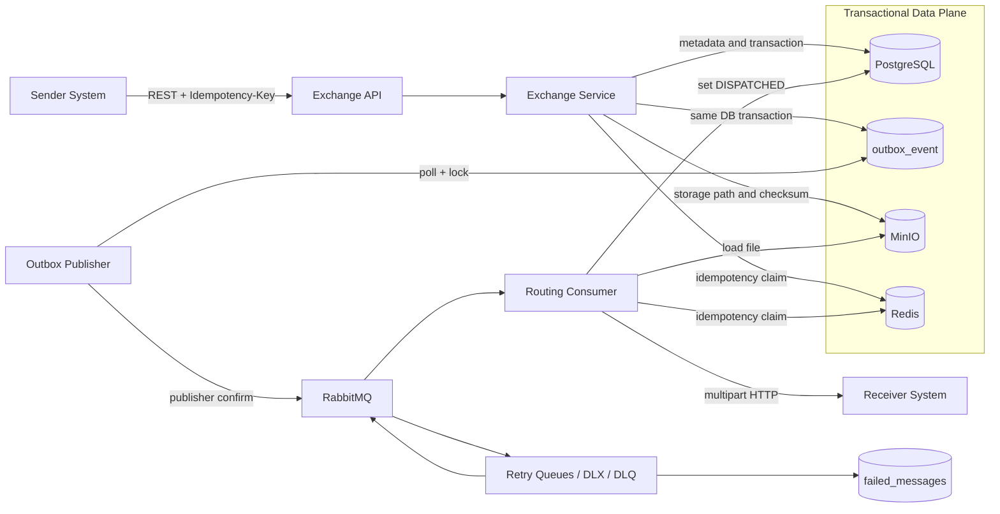
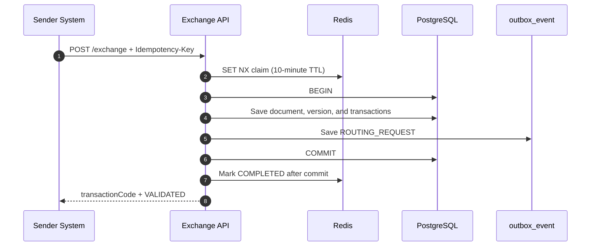
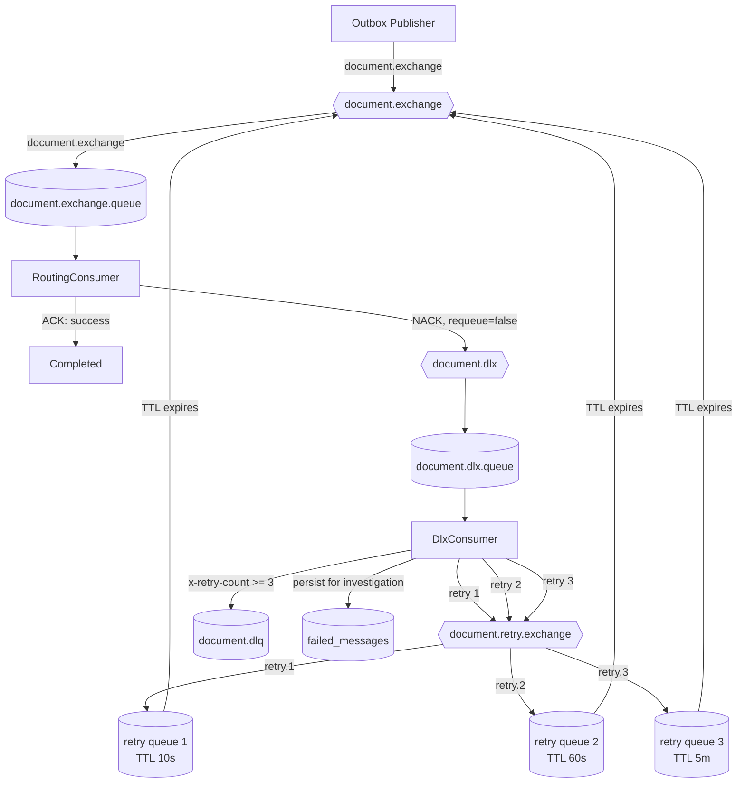
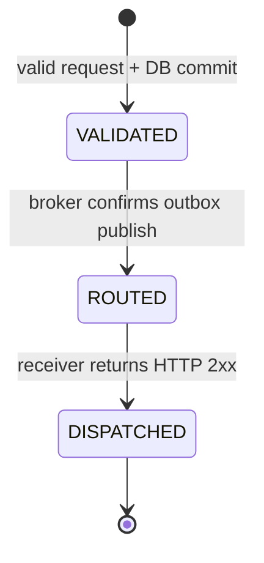

# TrucVanban

TrucVanban is a middleware platform for exchanging electronic documents between organizations. It accepts documents through an API, persists business state and file references, and coordinates asynchronous delivery through RabbitMQ.

The project focuses on more than document CRUD. Its core concern is **reliable messaging**: preserving requests after the database commits, tolerating temporary receiver failures, controlling duplicate messages, and providing an operational trail when a message cannot be processed automatically.

## Architecture Goals

- Decouple the inbound HTTP request lifecycle from delivery to external systems.
- Preserve delivery intent with the Transactional Outbox pattern instead of publishing directly to RabbitMQ inside the request transaction.
- Embrace `at-least-once` delivery and design consumers to be idempotent.
- Retry with delays without hot requeue loops or blocked worker threads.
- Isolate failed messages in a DLQ instead of allowing them to block the main queue.
- Track transaction state, business history, and failed messages in PostgreSQL.

## System Architecture



### Component Responsibilities

| Component | Responsibility |
| --- | --- |
| Exchange API | Validates input, signatures, and `Idempotency-Key`; creates documents and transactions |
| PostgreSQL | Source of truth for business state, outbox events, audit records, and failed messages |
| MinIO | Stores file content; messages contain only metadata and storage paths |
| Outbox Publisher | Reads pending events, publishes them to RabbitMQ, and waits for broker confirms |
| RabbitMQ | Buffers load, routes messages, and decouples producers from document delivery |
| Routing Consumer | Downloads files, calls receiver endpoints, and decides whether to ACK or NACK |
| Redis | Stores short-lived idempotency claims for the API and routing consumer |
| DLX/DLQ | Coordinates retries and isolates messages that cannot recover automatically |

## Document Delivery Flow

### 1. Accept the Request and Write the Outbox Event



`ExchangeTransactions` and `OutboxEvent` are written in the same database transaction. As a result:

- If the transaction rolls back, the event does not exist.
- If the transaction commits, the delivery intent remains durable in PostgreSQL even when RabbitMQ is temporarily unavailable.
- The API does not need to keep the connection open until the receiver finishes processing the document.

### 2. Publish Outbox Events to RabbitMQ

The scheduler runs according to `outbox.publisher.fixed-delay-ms`, which defaults to five seconds:

1. Select up to 50 due `NEW` events using `FOR UPDATE SKIP LOCKED`.
2. Convert each payload into a `RoutingRequest`.
3. Publish it to `document.exchange` with the `document.exchange` routing key.
4. Wait up to five seconds for a correlated publisher confirm and check for a returned message.
5. When the broker ACKs the publish, mark the event as `PROCESSED` and the transaction as `ROUTED`.
6. If publishing fails, schedule another attempt after 5, 15, and 30 minutes; mark the event as `FAILED` after all attempts are exhausted.

`SKIP LOCKED` allows multiple publisher instances to operate without selecting the same batch concurrently. A publisher confirm proves that the broker accepted the message, but it does not provide exactly-once delivery: the process can still terminate after the broker ACK and before the database transaction commits. A later poll may publish the same event again, so the consumer must tolerate duplicates.

## RabbitMQ Design

### Topology

| Type | Name | Purpose |
| --- | --- | --- |
| Topic exchange | `document.exchange` | Entry point for routing messages |
| Main queue | `document.exchange.queue` | Work queue consumed by `RoutingConsumer` |
| Direct DLX | `document.dlx` | Receives messages rejected by the main queue consumer |
| DLX queue | `document.dlx.queue` | Consumed by `DlxConsumer`, which selects a retry stage or terminates processing |
| Direct exchange | `document.retry.exchange` | Routes messages to the appropriate retry stage |
| Retry queue | `document.retry.queue.1` | 10-second delay |
| Retry queue | `document.retry.queue.2` | 60-second delay |
| Retry queue | `document.retry.queue.3` | 5-minute delay |
| Final queue | `document.dlq` | Retains messages that failed after all retry attempts |

All queues are durable. The main queue dead-letters to `document.dlx`; each retry queue has its own TTL and dead-letters back to the main exchange when that TTL expires.



### ACK, NACK, and Back Pressure

- Listeners use manual acknowledgements and call `basicAck` only after routing finishes successfully.
- On failure, the consumer calls `basicNack(requeue=false)` so the message goes through the DLX instead of entering an immediate requeue loop.
- `prefetch=1` limits each consumer to one unacknowledged message, which is appropriate for relatively heavy HTTP and file-transfer work.
- With three retry queues, a message can be processed at most four times: the initial attempt plus three retries.
- The `x-retry-count` header selects the retry stage. Previous `x-death` headers are removed before republishing to prevent metadata from accumulating across retry cycles.

### Why Use Multiple Retry Queues

RabbitMQ does not delay individual messages with backoff when they are simply requeued to the main queue. TTL queues provide delays without holding a consumer thread:

```text
initial attempt -> failure -> 10 seconds -> retry 1
retry 1 -> failure -> 60 seconds -> retry 2
retry 2 -> failure -> 5 minutes -> retry 3
retry 3 -> failure -> DLQ + failed_messages
```

This approach is simple and observable. The trade-off is that the number of delay stages is finite and currently declared in code. If more dynamic retry schedules are required, the system could use the RabbitMQ delayed-message exchange plugin or a database-backed retry scheduler.

## Reliability and Idempotency

### Existing Guarantees

| Risk | Mechanism | Scope of the Guarantee |
| --- | --- | --- |
| The database commits before RabbitMQ accepts the message | Transactional Outbox | The event remains in the database for another publish attempt |
| The target exchange or routing key is invalid | `mandatory=true` + publisher returns | The publisher detects an unroutable message |
| The broker does not confirm the publish | Correlated publisher confirm | The outbox event is not marked `PROCESSED` |
| Multiple publishers poll concurrently | `FOR UPDATE SKIP LOCKED` | Prevents two workers from claiming the same event at the same time |
| A client submits the same request more than once | Redis `SET NX` keyed by `Idempotency-Key` | Blocks duplicate requests within a 10-minute TTL window |
| RabbitMQ redelivers a routing message | Redis `SET NX` keyed by `transactionCode:receiverCode` | Reduces concurrent processing and duplicates within a 10-minute TTL window |
| The receiver fails temporarily | TTL-based retry queues | Backoff of 10 seconds, 60 seconds, and 5 minutes |
| A message continues to fail | DLQ + `failed_messages` table | Isolates the message and stores its payload and error for investigation |
| The service restarts | Durable queues, persistent volumes, and the database outbox | Restores stored messages and persisted delivery intent |

### Delivery Semantics

The system uses **at-least-once delivery**. Duplicates can still occur in the following failure windows:

- The broker accepts a message before the outbox event is marked `PROCESSED`.
- The receiver processes the HTTP request, but the response is lost or the consumer terminates before ACKing the message.
- Redis loses data, an idempotency key expires, or a consumer restarts after the idempotency window.

For this reason, `transactionCode` must propagate through the entire flow, and receiver systems should persist it with a unique constraint or idempotency record. When the same `transactionCode` arrives again, the receiver should return the original result instead of creating another business side effect.

### Production Reliability Improvements

1. **Durable consumer idempotency**: replace the Redis-only TTL record with a `processed_messages` table that has a unique `(event_id, consumer_name)` key, or use a compare-and-set business state machine in PostgreSQL. Redis can remain a fast locking layer, but the database should provide the durable record.
2. **End-to-end receiver idempotency**: require receiver endpoints to treat `transactionCode` as an idempotency key and persist the response. This is the only protection against duplicate side effects when the HTTP call succeeds but its response or RabbitMQ ACK is lost.
3. **Outbox leases and shorter transactions**: avoid holding a database transaction while waiting for a network confirm. Claim a batch with a status or lease, publish outside the transaction, and then persist the result. A watchdog is required to reclaim expired leases.
4. **Controlled DLQ replay**: add investigation status, operator ownership, failure classification, a replay endpoint, and audit logs. Replayed messages must retain the same event ID and idempotency key rather than receiving a new identity.
5. **Observability**: measure queue depth, unacknowledged count, oldest-message age, publisher-confirm latency, retry count, outbox backlog, and the number of `FAILED` events; alert when thresholds are exceeded.
6. **Quorum queues**: for a production RabbitMQ cluster, consider quorum queues so messages are replicated across nodes. A durable queue on a single broker does not protect against losing the entire node or its volume.
7. **Poison-message policy**: distinguish retryable errors such as timeouts and 5xx responses from permanent failures such as invalid payloads, missing receivers, and business-related 4xx responses. Permanent failures should reach the DLQ sooner.
8. **Externalized policies**: move TTL values, maximum retry counts, confirm timeouts, and outbox retention into configuration so they can vary by environment without rebuilding the application.

## Core Business State



In addition to single-step delivery, the project supports multi-party signing, parallel distribution, acknowledgements, document recall and replacement, organization and certificate management, and SLAs. These flows share the same transaction, outbox, and routing infrastructure.

## Source Structure

```text
src/main/java/com/TrucVanban
├── exchange/       # Document intake, state, and business workflows
├── routing/        # RabbitMQ consumers and HTTP dispatch
├── registry/       # Organizations, certificates, endpoints, and SLAs
├── storage/        # MinIO integration
└── shared/
    ├── config/     # RabbitMQ and shared configuration
    ├── outbox/     # Outbox entity, repository, publisher, and scheduler
    ├── dlq/        # Failed-message persistence and queries
    └── security/   # HMAC, signatures, authentication, and authorization
```

Important entry points:

- `RabbitMQConfig`: declares exchanges, queues, bindings, TTL values, and the message converter.
- `OutboxEventPublisherServiceImpl`: polls the outbox, waits for publisher confirms, and retries publishing.
- `RoutingConsumer`: consumes the main queue and performs manual ACK/NACK operations.
- `DlxConsumer`: selects a retry stage or transfers the message to the final DLQ.
- `RoutingServiceImpl`: handles idempotency, file download, and HTTP dispatch.

## Technology Stack

- Java 21 and Spring Boot 3.5
- Spring Web, Spring Data JPA, Spring AMQP, and Spring Security
- PostgreSQL 16 and Flyway
- RabbitMQ 3.13
- Redis 7
- MinIO
- Testcontainers and JUnit 5

## Running the Project

### Prerequisites

- Docker and Docker Compose
- Java 21 when running or testing directly with Maven

### Run the Full Stack with Docker Compose

```bash
cp .env.example .env
docker compose up -d
docker compose ps
```

The application is exposed through Nginx at `http://localhost`. Its health endpoint is `http://localhost/api/v1/actuator/health`. The RabbitMQ Management UI is bound to localhost only at `http://localhost:15672`.

Replace all example secrets in `.env.example` before deployment. PostgreSQL, Redis, RabbitMQ, and MinIO run on the internal network; do not expose their service ports directly in production.

### Main Configuration

| Variable | Purpose | Default |
| --- | --- | --- |
| `DB_URL`, `DB_USERNAME`, `DB_PASSWORD` | PostgreSQL connection | Required |
| `RABBITMQ_HOST`, `RABBITMQ_PORT` | RabbitMQ AMQP endpoint | Required |
| `RABBITMQ_USERNAME`, `RABBITMQ_PASSWORD` | RabbitMQ credentials | Required |
| `REDIS_HOST`, `REDIS_PORT`, `REDIS_PASSWORD` | Redis idempotency and cache | Required |
| `MINIO_ENDPOINT`, `MINIO_ACCESS_KEY`, `MINIO_SECRET_KEY`, `MINIO_BUCKET` | Object storage | Required |
| `OUTBOX_PUBLISHER_FIXED_DELAY_MS` | Outbox polling interval | `5000` ms |

### Tests

```bash
./mvnw test
```

Run the complete integration test suite against real PostgreSQL, Redis, and RabbitMQ instances managed by Testcontainers:

```bash
./mvnw verify
```

The machine running the integration tests must have access to a Docker daemon.

## RabbitMQ Operations

Monitor the following metrics regularly:

- `document.exchange.queue`: ready messages, unacknowledged messages, and consumer count.
- `document.dlx.queue`: queued messages indicate a problem with the retry coordinator.
- The three retry queues: message age and the rate at which messages return to the main queue.
- `document.dlq`: every new message should trigger an alert and an investigation workflow.
- `outbox_event`: the number of `NEW` and `FAILED` events, and the age of the oldest event.
- `failed_messages`: error trends by receiver, endpoint, and time.

Do not delete or manually republish DLQ messages before identifying the root cause. A replay must preserve the original message identity, and the receiver must provide idempotency to prevent duplicate document delivery.

## Current Limitations

- Routing idempotency relies on Redis with a 10-minute TTL and does not provide durable deduplication.
- The DLQ supports database persistence and query APIs, but it does not yet have a complete replay and resolution workflow.
- Retry policies and outbox retention are still constants in the source code.
- Durable queues do not provide high availability when RabbitMQ runs as a single node.
- HTTP dispatch and RabbitMQ acknowledgement cannot participate in the same distributed transaction; the design must rely on at-least-once delivery and end-to-end idempotency.

## Related Documentation

- `business/outbox_routing_duplicate_message_analysis.md`: analysis of duplicate-message race conditions between the outbox publisher and routing consumer.
- `docs/backend-deployment.md`: immutable-image backend deployment model.
- `src/main/resources/db/migration`: Flyway schema history.
