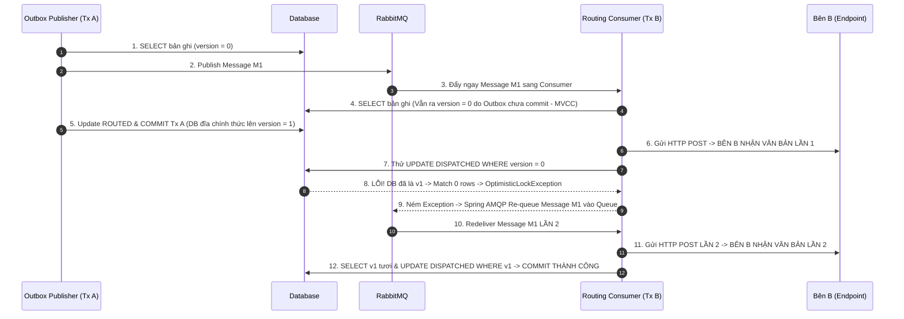

# TÓM TẮT SỰ CỐ: GỬI TRÙNG VĂN BẢN VÀ CÁCH XỬ LÝ

---

## 📊 1. SƠ ĐỒ THỨ TỰ THỜI GIAN THỰC THI (SEQUENCE DIAGRAM)



---

## 📌 2. NGUYÊN NHÂN GỐC RỄ (BẢN CHẤT LỖI)

Đây là bài toán **"2 Transaction cùng đọc dữ liệu cũ v0 và cùng tranh nhau sửa trạng thái"**:

1. **Outbox (Transaction A)**: Đọc DB (v0) → Bắn message lên Queue → Đổi trạng thái thành `ROUTED` (v1) và Commit.
2. **Routing Consumer (Transaction B)**: 
   - Nhận message → Đọc DB (vẫn ra v0 do Outbox chưa commit xong).
   - Gửi HTTP sang đơn vị B → **Đơn vị B nhận văn bản LẦN 1**.
   - Cập nhật trạng thái thành `DISPATCHED` → **LỖI Optimistic Lock** (do DB đã bị Outbox đổi lên v1, không còn là v0).
3. **Kết quả**: Transaction B bị ném lỗi → RabbitMQ tự động đẩy lại message vào Queue (Re-queue) → Consumer chạy lại lần 2 và gửi HTTP lần 2 → **Đơn vị B bị nhận văn bản LẦN 2**.

---

## 🔑 3. BA ĐIỂM KỸ THUẬT CẦN LƯU Ý

- **Cơ chế MVCC**: Giấu dữ liệu chưa commit của Outbox, bắt Consumer ở lượt 1 phải đọc ra v0.
- **Lỗi `WHERE version = 0`**: Hibernate tự chèn `WHERE version = 0`. Khi DB đã lên v1, lệnh UPDATE khớp 0 dòng → Ném lỗi Optimistic Lock.
- **Bên nào commit trước cũng bị trùng**:
  - Outbox commit trước → Consumer lỗi → **Re-queue gửi lại**.
  - Consumer commit trước → Outbox lỗi → **Outbox Retry publish lại**.

---

## 🛠️ 4. GIẢI PHÁP KHẮC PHỤC (SỬA 2 BƯỚC)

### Bước 1: Outbox Publisher
- **Bỏ cập nhật `ROUTED`** vào bảng `ExchangeTransactions`. Outbox chỉ publish message và đổi `outbox_event` thành `PROCESSED`.

### Bước 2: Routing Service
- **Bỏ `@Transactional`** ở phương thức `dispatch()` chính (tải file & gửi HTTP ngoài Transaction DB).
- Sau khi gửi HTTP thành công, mở Transaction ngắn riêng để đổi trạng thái thành `DISPATCHED`.

```java
// Trong RoutingServiceImpl.java:

// 1. Hàm dispatch chính KHÔNG CÓ @Transactional
public RoutingResponse dispatch(RoutingRequest request) {
    RoutingData data = validateAndFetchData(request.getTransactionCode());

    // Chống gửi trùng nếu đã gửi rồi
    if (data.transaction().getCurrentStatus() == TransactionStatus.DISPATCHED) {
        return buildResponse(data.transaction());
    }

    // Tải file & Gửi HTTP ngoài Transaction DB
    byte[] fileContent = downloadFile(data.version());
    executeDispatch(data, fileContent, buildFileName(data.document(), data.version()));

    // Cập nhật DB sau khi gửi HTTP thành công
    updateStatusToDispatched(data.transaction().getId());

    return buildResponse(data.transaction());
}

// 2. Transaction ngắn riêng để update DB
@Transactional
public void updateStatusToDispatched(Long transactionId) {
    ExchangeTransactions transaction = exchangeTransactionsRepository.findById(transactionId).orElseThrow();
    transaction.setCurrentStatus(TransactionStatus.DISPATCHED);
    exchangeTransactionsRepository.save(transaction);
}
```
